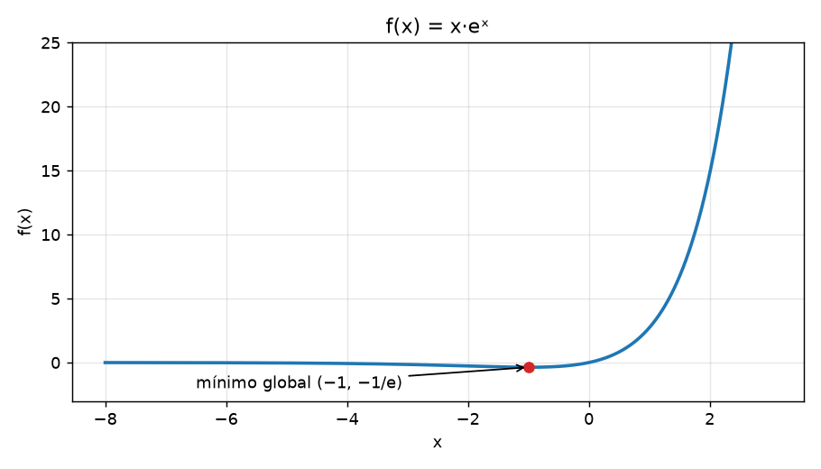
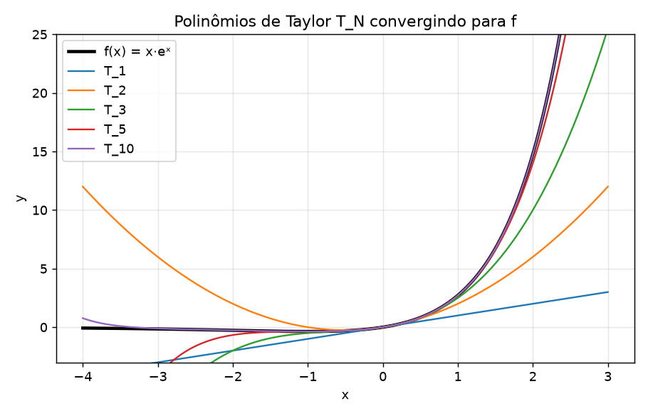
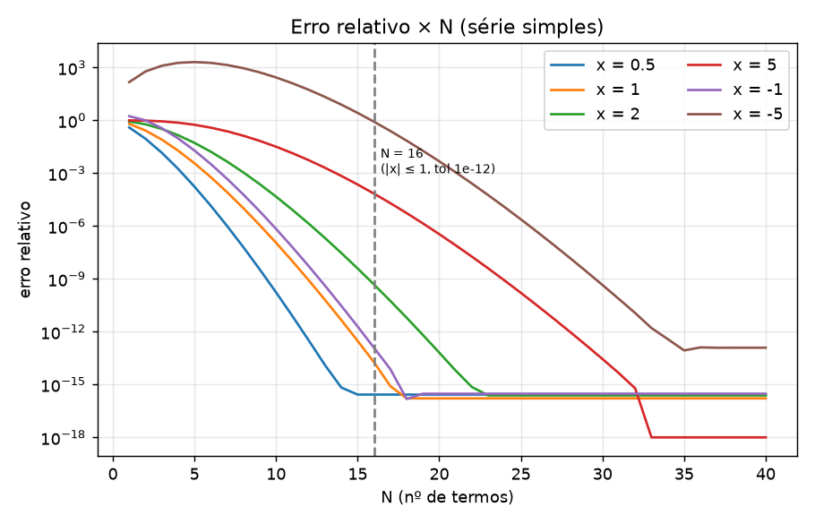
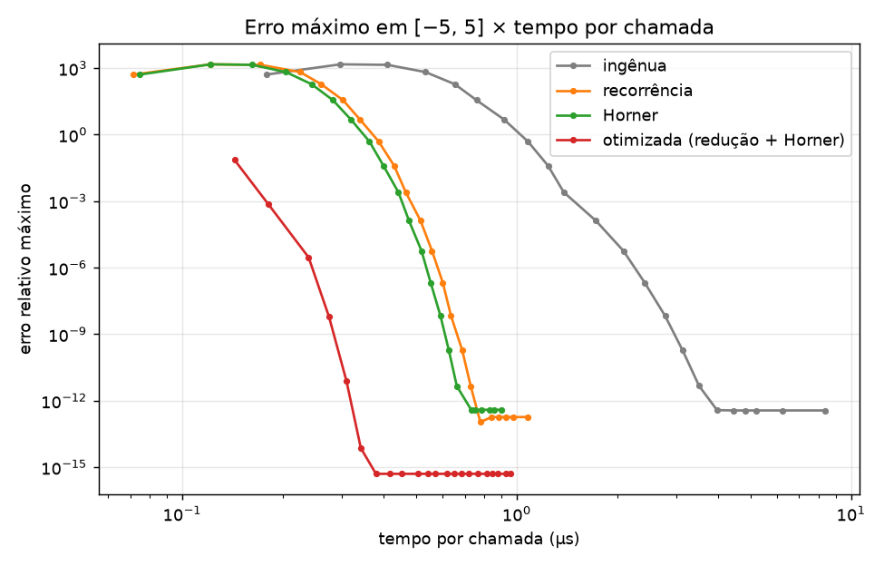

# Resultados: o que é cada arquivo

Estes arquivos são gerados por `python3 src/benchmark.py`. Cada um responde a um item que o enunciado pede. Valores de tempo dependem da máquina.

| arquivo | item do enunciado | pergunta que responde |
|---|---|---|
| `1_funcao.png` | aproximações e propriedades | Como é a função? |
| `2_aproximacoes.png` | aproximações e propriedades | O polinômio realmente chega perto da função? |
| `3_erro_vs_N.png` | valor de N e por quê | Quantos termos eu preciso? |
| `escolha_N.md` | valor de N e por quê | A mesma resposta, em números, com garantia matemática |
| `tabela_valores.md` | tabela de valores mais usados | Quanto vale e quanto erro tem em cada x? |
| `4_erro_vs_tempo.png` | erros × tempo de execução | Qual jeito de programar é melhor? |
| `tempos.md` | erros × tempo de execução | A mesma resposta, em números |

---

## `1_funcao.png` – o gráfico de f(x) = x·eˣ

**Como ler:** eixo x é a entrada, eixo y é f(x). O ponto vermelho é o menor valor da função.

**O que mostra:**
- À esquerda a curva fica colada em 0 (tende a 0 quando x → −∞).
- Ela desce até o mínimo em x = −1, onde vale −1/e ≈ −0,368.
- Depois sobe e explode para a direita (cresce muito rápido).

**Por que está aqui:** o enunciado pede "propriedades da função". Esta é a visão geral.

---

## `2_aproximacoes.png` – a função contra os polinômios de Taylor

**Como ler:** a linha preta grossa é a função de verdade. As coloridas são o polinômio de Taylor com N termos (T₁, T₂, T₃, T₅, T₁₀).

**O que mostra:**
- T₁(x) = x é uma reta: boa só bem perto de 0.
- Cada termo a mais deixa o polinômio colado na função por um trecho maior.
- T₁₀ já cobre bem de −3 até 2 ou mais.
- Quanto mais longe de 0, mais termos precisa.

**Por que está aqui:** é a prova visual de que a série funciona.

---

## `3_erro_vs_N.png` – quantos termos usar

**Como ler:** eixo x é o número de termos N. Eixo y é o **erro relativo** (quanto erramos em relação ao valor certo, 0,01 = 1%). A escala é **logarítmica**: cada linha de grade é 10× menor que a anterior, então uma curva descendo é o erro caindo muito rápido. Cada cor é um valor de x.

**O que mostra:**
- O erro cai rápido até um piso em torno de **1e-16**. Esse piso é o limite do computador (`float64` só guarda ~16 dígitos), então mais termos não ajudam.
- Para x pequeno (0,5; 1) o piso chega com poucos termos. Para x grande (5) precisa de bem mais.
- Para x negativo grande (−5) o erro não chega ao piso, e isso é um defeito da série simples: os termos são grandes e se cancelam (cancelamento numérico).
- A linha tracejada marca N = 16, o valor escolhido para |x| ≤ 1.

**Por que está aqui:** o professor pergunta "qual N e por quê".

---

## `escolha_N.md` – o N com garantia matemática

| intervalo [-a, a] | N mínimo (Lagrange < 1e-12) | cota com esse N |
|---:|---:|---:|
| 0.5 | 12 | 4.4e-13 |
| 1 | 16 | 1.4e-13 |
| 2 | 21 | 6.6e-13 |
| 5 | 35 | 2.4e-13 |

**O que é:** a **cota de Lagrange** é uma fórmula que dá o erro **máximo** que a série pode ter, sem precisar calcular o valor exato. Para cada intervalo [−a, a] procuramos o menor N em que essa cota fica abaixo de 1e-12 (uma tolerância que escolhemos).

**Como ler:** se vou usar a fórmula só para x entre −1 e 1, N = 16 garante erro menor que 1e-12. Se quero até |x| = 5, preciso de N = 35.

**O que ensina:** o N **depende de até onde se quer usar a fórmula**. Não existe um N único. O gráfico `3_erro_vs_N.png` confirma na prática que o erro real fica abaixo dessa garantia.

---

## `tabela_valores.md` – tabela de valores mais usados

| x | f(x) exato | Taylor simples | erro simples | Taylor otimizada | erro otimizada |
|---:|---:|---:|---:|---:|---:|
| 1 | 2.71828182846 | 2.71828182846 | 1.8e-14 | 2.71828182846 | 1.6e-16 |
| 10 | 220264.657948 | 209528.869686 | 4.9e-02 | 220264.657948 | 5.3e-16 |

(a tabela completa está no arquivo, de x = −5 até 10)

**Como ler:** cada linha é um x. "Exato" é o valor de referência do Python (`x * math.exp(x)`). Depois vêm o valor calculado pela série e o erro relativo (4.9e-02 = 4,9%, 1.6e-16 = 0,000000000000016%).

**O que mostra:**
- A série simples (N = 16) é ótima perto de 0 e vai piorando longe: em x = 10 erra quase 5% e em x = −5 erra 83%.
- A versão otimizada fica em ~1e-16, o limite do computador, em **todos** os x.

**Por que está aqui:** o enunciado pede a tabela de valores mais usados. Ela mostra, em números, o que a otimização resolve.

---

## `4_erro_vs_tempo.png` e `tempos.md` – qual jeito de programar é melhor

| método | menor N com erro < 1e-10 | tempo (µs) |
|---|---:|---:|
| ingênua | 32 | 3.51 |
| recorrência | 32 | 0.73 |
| Horner | 32 | 0.66 |
| otimizada (redução + Horner) | 10 | 0.31 |

**O que é cada método:** são 4 jeitos de calcular **a mesma** série.
- **Ingênua:** recalcula potência e fatorial a cada termo.
- **Recorrência:** cada termo vem do anterior (t = t·x/k), sem fatorial.
- **Horner:** agrupa as contas para fazer menos multiplicações.
- **Otimizada:** primeiro reduz x para um valor pequeno (eˣ = 2ᵐ·eʳ com |r| ≤ 0,35) e só então soma a série, então precisa de bem menos termos.

**Como ler o gráfico:** eixo x é o tempo por chamada (µs, quanto mais à esquerda, mais rápido). Eixo y é o erro máximo no intervalo [−5, 5] (quanto mais embaixo, mais preciso, escala log). O melhor método está no **canto inferior esquerdo**. Cada ponto é um N diferente (2, 4, 6, …).

**O que mostra:**
- A curva vermelha (otimizada) está sempre mais embaixo e à esquerda: mais precisa **e** mais rápida.
- A cinza (ingênua) é a mais lenta: o mesmo erro custa ~5× mais tempo que a recorrência e ~11× mais que a otimizada.
- As curvas "achatam" em baixo (~1e-13 e ~1e-16): é o piso do `float64`, não adianta mais termos.

**Por que está aqui:** o enunciado pede "erros da função × tempo de execução" e o "código da função otimizada".
